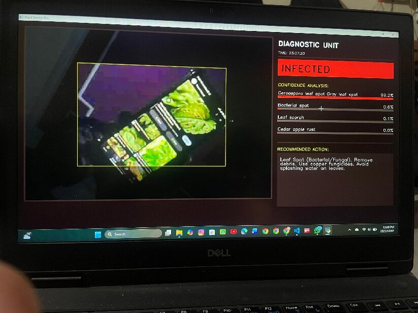
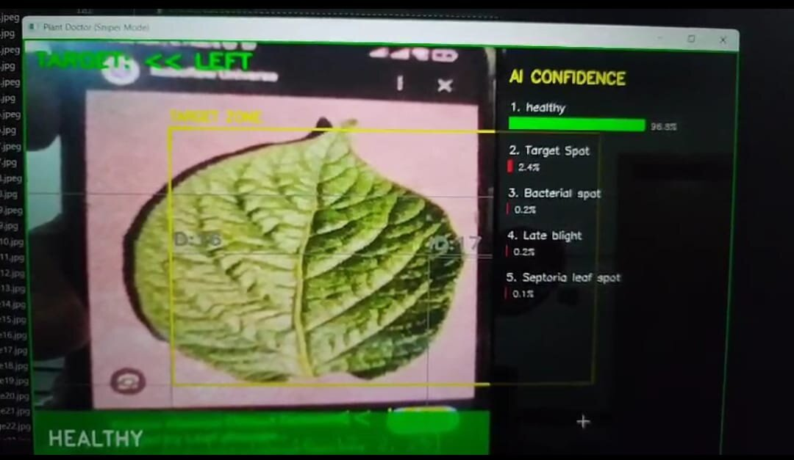
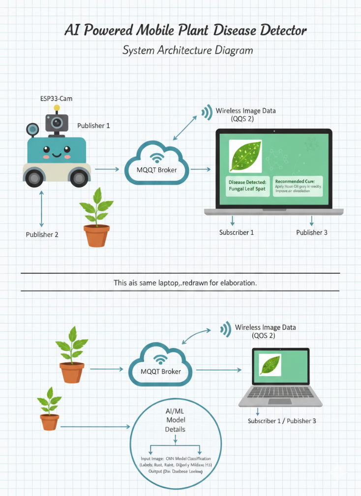
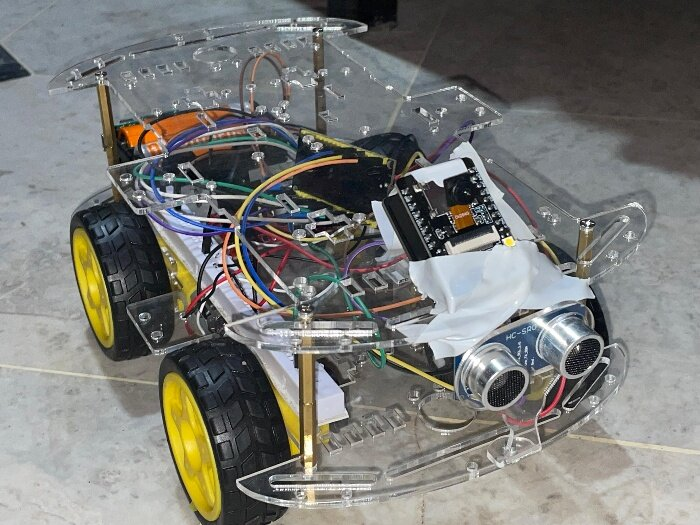
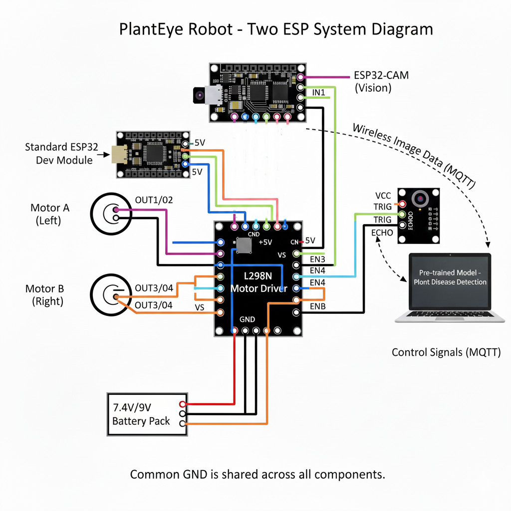

<div align="center">

# 🌱 PlantEye

### Vision-Based Autonomous Plant Disease Detector

*An autonomous rover that hunts down plants in a garden, photographs their leaves, and diagnoses crop diseases with AI — in real time.*

[](#)
[-00599C?logo=cplusplus&logoColor=white)](#)
[](#)
[](#)
[](#)
[](#)
[](LICENSE)

</div>

<br>

<div align="center">
  
  
</div>

<br>

---

## 📑 Table of Contents

- [Overview](#-overview)
- [Key Features](#-key-features)
- [System Architecture](#-system-architecture)
- [How It Works](#-how-it-works)
- [Hardware](#-hardware)
- [Circuit Design](#-circuit-design)
- [Repository Structure](#-repository-structure)
- [Tech Stack](#-tech-stack)
- [Getting Started](#-getting-started)
  - [1. Flash the Firmware](#1-flash-the-firmware)
  - [2. Set Up the AI Engine](#2-set-up-the-ai-engine)
  - [3. Run the System](#3-run-the-system)
- [MQTT Topic Reference](#-mqtt-topic-reference)
- [Challenges &amp; Solutions](#-challenges--solutions)
- [Future Improvements](#-future-improvements)
- [The Team](#-the-team)
- [License](#-license)

---

## 🌾 Overview

Plant disease wipes out a staggering share of the world's crops every single year, and for small-scale farmers and home gardeners, catching an infection early is often the difference between a healthy harvest and a ruined one — yet professional diagnostic tools are usually too expensive or too slow to be practical.

**PlantEye** is our answer: a low-cost, autonomous four-wheeled rover that patrols a garden, uses computer vision to spot plants, photographs their leaves, and runs the image through a disease-classification model — all without a human ever picking up a camera. Within seconds, it returns a diagnosis and an actionable treatment recommendation on a live dashboard.

This was built as a semester project for **Programming for Artificial Intelligence** at **FAST NUCES, Islamabad**.

> 📄 The complete project write-up — including team work distribution and full technical detail — is summarized in this README. The original submitted report is also included at [`docs/PlantEye_Project_Report.docx`](docs/PlantEye_Project_Report.docx) for reference.

---

## ✨ Key Features

|      | Feature                                  | Description                                                                                                |
| ---- | ---------------------------------------- | ---------------------------------------------------------------------------------------------------------- |
| 🧭   | **Autonomous + Manual Navigation** | Drives itself using an obstacle-aware control loop, or can be remote-controlled over HTTP                  |
| 🔍   | **Real-Time Plant Detection**      | YOLOv8n locates potted plants in the live video feed and tracks the largest one as a target                |
| 📡   | **Wireless Image Streaming**       | The ESP32-CAM streams JPEG frames to the base station over WiFi — no cables, no SD cards                  |
| 🧠   | **AI-Powered Disease Diagnosis**   | A MobileNetV2-based TensorFlow Lite model classifies leaf images across**38 disease/health classes** |
| 💊   | **Instant Treatment Advice**       | A built-in knowledge base maps every diagnosis to a practical, actionable treatment                        |
| 📊   | **Live Diagnostic Dashboard**      | A "mission control" style OpenCV UI shows the camera feed, confidence bars, and recommended action         |
| 🔁   | **Continuous Scanning**            | Once one plant is diagnosed, the rover automatically resumes searching for the next                        |
| 🛡️ | **Obstacle Avoidance**             | An ultrasonic sensor halts the rover before it collides with anything in its path                          |

---

## 🏗 System Architecture

The system is split into **two independent ESP32 modules** and a **laptop "brain"**, all communicating wirelessly over MQTT — this keeps heavy AI inference off the microcontrollers entirely.

<div align="center">
  
</div>

| Module                    | Responsibility                                                                                    | Hardware                                |
| ------------------------- | ------------------------------------------------------------------------------------------------- | --------------------------------------- |
| **Navigation Unit** | Drives the motors, avoids obstacles, executes HTTP movement commands                              | ESP32 Dev Module, L298N driver, HC-SR04 |
| **Vision Unit**     | Captures JPEG frames and streams them over MQTT in chunks                                         | ESP32-CAM (AI-Thinker)                  |
| **AI Base Station** | Runs YOLOv8n for plant detection + steering, then MobileNetV2 (TFLite) for disease classification | Laptop                                  |

All wireless transport runs over **MQTT**, chosen specifically for its lightweight footprint and **Quality of Service (QoS) guarantees** — ensuring image chunks arrive complete and in order even over a flaky WiFi link.

---

## ⚙️ How It Works

1. **Robot Movement** — The rover drives forward while the ultrasonic sensor continuously measures distance to detect obstacles in its path.
2. **Plant Detection** — YOLOv8n scans incoming video frames for the `potted plant` class and locks onto the largest detected target.
3. **Auto-Steering** — The AI base station compares the target's position to the frame center and sends `forward` / `left` / `right` / `stop` commands to the navigation ESP32 over HTTP until the plant fills the frame.
4. **Image Capture** — Once aligned, the ESP32-CAM captures a high-resolution frame of the leaves.
5. **Wireless Transmission** — The frame is chunked and published over MQTT to the base station.
6. **AI Diagnosis** — The MobileNetV2 TFLite model classifies the leaf image against 38 known classes and returns the top-5 predictions with confidence scores.
7. **Results & Resume** — The dashboard displays the diagnosis, confidence breakdown, and a treatment recommendation pulled from the built-in knowledge base. The rover then resumes scanning for the next plant.

---

## 🔧 Hardware

**Main Components**

- ESP32-CAM Module (camera + WiFi)
- Standard ESP32 Dev Module
- HC-SR04 Ultrasonic Sensor
- L298N Motor Driver
- 4× DC Motors with Wheels
- Robot Chassis with Mounts

**Supporting Components**

- 7.4V / 9V Battery Pack
- 5V Power Regulator
- Jumper Wires & Breadboard
- Laptop (for AI inference)

<div align="center">
  
</div>

---

## 🔌 Circuit Design

Two ESP32 modules work side-by-side, sharing a **common ground** across all components to keep signals clean. The standard ESP32 owns motor control and obstacle sensing via the L298N driver; the ESP32-CAM runs independently and focuses purely on image capture and transmission, preventing power and timing conflicts between the camera and the motors.

<div align="center">
  
</div>

---

## 📂 Repository Structure

```
PlantEye/
├── firmware/                      # ESP32 device code (Arduino sketches)
│   ├── esp32_cam_streamer/
│   │   └── esp32_cam_streamer.ino     # Camera capture + MQTT image/video streaming
│   └── motor_controller/
│       └── motor_controller.ino       # Motor driving, HTTP control API, obstacle avoidance
│
├── ai-engine/                     # Runs on the laptop / base station
│   ├── mqtt_receiver.py               # MQTT stream decoder + YOLOv8n plant tracking + autopilot
│   ├── plant_doctor.py                # MobileNetV2 (TFLite) disease classifier + live dashboard UI
│   └── requirements.txt
│
├── models/                        # Pre-trained AI models
│   ├── yolov8n.pt                     # YOLOv8 nano — plant detection
│   └── plant_disease.tflite           # MobileNetV2 — 38-class disease classifier
│
├── sample_data/
│   └── captured_images/               # Example leaf captures pulled from the live rover
│
├── docs/
│   └── images/                        # Architecture & circuit diagrams, demo screenshots
│
├── .gitignore
├── LICENSE
└── README.md
```

---

## 🧰 Tech Stack


-3C5280?style=flat-square&logo=eclipsemosquitto&logoColor=white)


---

## 🚀 Getting Started

### 1. Flash the Firmware

You'll need the **Arduino IDE** with the ESP32 board package installed.

**Libraries required:**

| Sketch                     | Libraries                                                                                  |
| -------------------------- | ------------------------------------------------------------------------------------------ |
| `esp32_cam_streamer.ino` | `WiFi.h`, `PubSubClient`, `esp_camera.h` (bundled with ESP32 core, AI-Thinker board) |
| `motor_controller.ino`   | `WiFi.h`, `WebServer.h`                                                                |

**Before uploading**, open each `.ino` file and replace the placeholders:

```cpp
const char* ssid = "YOUR_WIFI_SSID";
const char* password = "YOUR_WIFI_PASSWORD";
const char* mqtt_server = "192.168.1.100";   // your broker's local IP (esp32_cam_streamer.ino only)
```

> ⚠️ **Board settings for the camera module:** Board = *AI Thinker ESP32-CAM*, Partition Scheme = *Huge APP (3MB No OTA)*, and connect via a USB-to-serial adapter (GPIO0 → GND during flashing).

### 2. Set Up the AI Engine

Install **[Mosquitto](https://mosquitto.org/)** (or any MQTT broker) on the laptop that will run the AI engine, then:

```bash
cd ai-engine
pip install -r requirements.txt
```

Update the robot's IP address in `mqtt_receiver.py`:

```python
ROBOT_IP = "192.168.1.101"   # the motor-controller ESP32's local IP
MQTT_BROKER = "localhost"    # or the broker's IP if running remotely
```

### 3. Run the System

```bash
# Terminal 1 — start the MQTT-powered vision + autopilot loop
python mqtt_receiver.py

# Terminal 2 — start the disease diagnosis dashboard
python plant_doctor.py
```

**Controls inside `mqtt_receiver.py`:**

| Key   | Action                                                                |
| ----- | --------------------------------------------------------------------- |
| `A` | Toggle autopilot (rover auto-tracks and approaches the nearest plant) |
| `C` | Capture the current frame for diagnosis                               |
| `Q` | Quit and stop the stream                                              |

Captured frames automatically drop into `ai-engine/captured_images/`, which `plant_doctor.py` watches and diagnoses in real time.

---

## 📡 MQTT Topic Reference

| Topic                       | Direction         | Purpose                                                                     |
| --------------------------- | ----------------- | --------------------------------------------------------------------------- |
| `planteye/camera/stream`  | ESP32-CAM → Base | Live JPEG frame chunks (`FRAME:size:chunks` → chunks → `FRAME_END`)   |
| `planteye/camera/image`   | ESP32-CAM → Base | High-res still capture chunks (`START:size:chunks` → chunks → `END`)  |
| `planteye/camera/command` | Base → ESP32-CAM | `CAPTURE`, `START_STREAM`, `STOP_STREAM`, `FLASH_ON`, `FLASH_OFF` |
| `planteye/camera/status`  | ESP32-CAM → Base | Online/offline status, retained Last-Will message                           |

---

## 🛠 Challenges & Solutions

| Challenge                                                                                                      | Solution                                                                                                      |
| -------------------------------------------------------------------------------------------------------------- | ------------------------------------------------------------------------------------------------------------- |
| **Hardware integration** — the camera and motors interfered with each other when sharing one controller | Split the system across**two independent ESP32 modules**, isolating imaging from motor control          |
| **Disease detection accuracy** — thousands of diseases look visually similar                            | Used**MobileNetV2**, pre-trained on a large plant-disease dataset, for a strong classification baseline |
| **Limited onboard compute** — the ESP32 can't run deep learning models                                  | Offloaded**all AI inference to the laptop**; the rover only captures and streams images                 |
| **Battery holder burnout** — a holder overheated under combined motor + camera current draw             | Replaced it with a higher-quality, better heat-dissipating holder and added a dedicated voltage regulator     |

---

## 🔮 Future Improvements

- 📍 **GPS tracking** to map exactly where diseased plants were found
- 💧 **Soil moisture sensing** to distinguish disease from simple water/nutrient stress
- 📱 A **mobile app** to replace the laptop dependency entirely
- 🌍 An **expanded disease database** covering ornamentals, trees, and more crop species

---

## 📜 License

Releasd under the [MIT License](LICENSE) — free to use, modify, and build on for educational or personal projects.

<div align="center">

**🌱 PlantEye — because every leaf deserves a checkup.**

</div>
